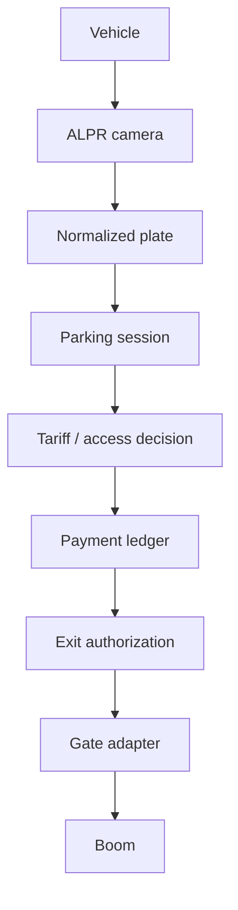

# Product vision

## Purpose

SmartPark Edge is a plate-first parking operating system. A camera read becomes a parking session, a tariff or access decision, optional payment, and a gate command. It does not depend on RFID take-scan-return as the identity.

## What owns this

The Site Server (`app/api_main.py` plus `app/services/`) owns sessions, tariffs, access plans, payments, users, and audit. Desktop and web are clients.

## What it must NOT do

- Treat a receipt, QR token, or card as the authoritative identity
- Call vendor SDK functions from parking/tariff/payment code
- Mark a mobile payment paid from a browser success screen
- Block every vehicle on imperfect OCR (confidence policy is configuration)
- Encode a gate’s marketing name into business logic

## Diagram

## Main data structures

- `ParkingSession` — site-wide stay keyed by normalized plate
- `AccessPlan` / `RegisteredVehicle` — season, VIP, staff, contractor
- `PaymentIntent` / `PaymentTransaction` — one ledger for kiosk and future mobile
- `AccessDecision` / `GateCommandRecord` — authorization and boom audit

## Request / event flow

Camera event → normalize plate → lookup entitlement → short DB transaction → decision → optional print → gate command. Image archive and reports stay off the critical path.

## Failure behavior

Duplicate plates reuse the open session. Unpaid casuals stay closed at any exit. Internet loss does not invent a mobile payment. SHADOW dry-runs automatic opens only.

## Security

RBAC is enforced in the API. Public `/p/{token}` cannot open barriers. Manual opens are audited.

## Configuration

Receipt policy: `OFF` | `PRINT_OPTIONAL` | `PRINT_AND_OPEN` (default) | `REQUIRE_TAKEN_BEFORE_OPEN`. Tariff is Car1 data on `tariffs`, not Python constants.

## Tests

`tests/test_simulation.py`, `tests/test_access_receipts.py`, `tests/test_adapters.py`.

## How to extend safely

Add cameras, gates, and payments as adapters. Do not put vendor `if` branches in `handle_plate_event`.

## Common mistakes

- Waiting for paper-taken before every open
- Hard-coding fees in services
- Building a second cash database beside the ledger
