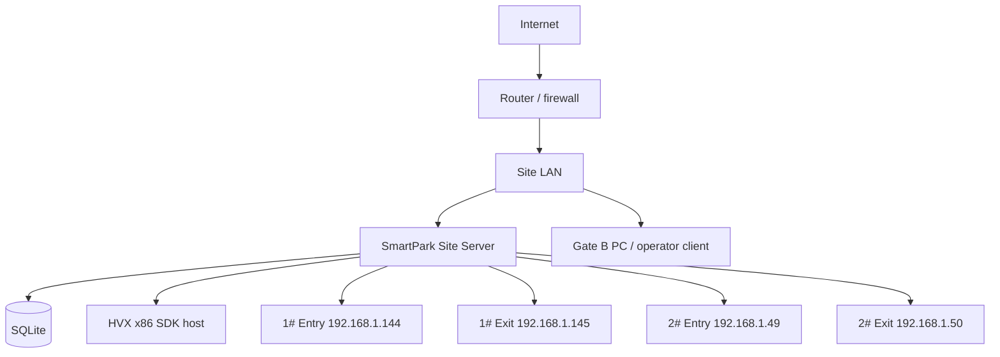

# Current site topology

## Purpose

Describe the live two-lane HVX site so software does not hard-code “the server is Gate A”.

## What owns this

`app/services/site_cameras.py` (`KNOWN_SITE_CAMERAS` / canonical lanes). Physical PCs and fiber are operations, not Python constants for gate names.

## What it must NOT do

- Assume the Site Server PC is a specific numbered gate
- SDK-connect Board* or IpAddr* devices
- Require a Gate B Edge Agent

## Diagram

## Main data structures

Each numbered lane has entry and exit sides. Each side:

| Role | Example 1# Entry | Protocol |
|---|---|---|
| Camera | 192.168.1.144 | NetSDK port 30000 |
| Controller (Board*) | 192.168.1.61 | TCP I/O — not SDK |
| Display (IpAddr*) | 192.168.1.62 | LED UDP — not SDK |

Sessions are site-wide: 1#→2# and 2#→1# are valid.

## Request / event flow

The Site Server talks DIRECT to all four cameras if the LAN allows it. A second PC can be an operator client.

## Failure behavior

If one camera is offline, other lanes still decide from local DB. `EDGE_AGENT` is refused on HVX connect.

## Security

Cameras, the database, and GPIO stay on the LAN. Only `/p/{token}` and future payment callbacks should be public.

## Configuration

Optional ParkWatch.ini on site PCs that still have it. Defaults in `_CANONICAL_LANES`.

## Tests

Seed-site / camera CRUD tests. Adapter tests assert DIRECT default.

## How to extend safely

Add a lane as camera + gate rows, not a new Python module named after the gate.

## Common mistakes

Connecting the LED or barrier board with `Net_ConnCamera`. Using HTTP port 80 as the SDK port.
