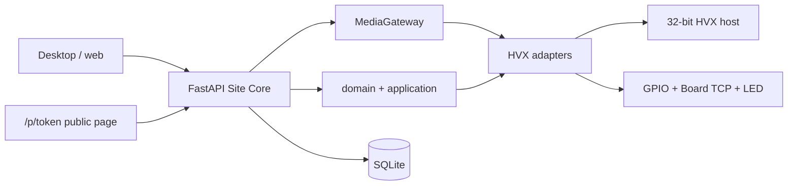

# System architecture

## Purpose

Show how the Site API, 32-bit camera host, desktop/web, and adapters fit together.

## What owns this

`app/` is the modular monolith. `tools/hvx_sdk_host/` is the 32-bit Windows sidecar. Protocols live in `app/domain`; adapters in `app/infrastructure`.

## What it must NOT do

- Relocate or rewrite `tools/hvx_sdk_host/`, `app/services/hvx_client.py`, or `app/services/gates.py`
- Switch default cameras to ONVIF/RTSP
- Make PostgreSQL a prerequisite (SQLite is the live store; `SMARTPARK_DATABASE_URL` can point at Postgres later)
- Require Edge Agents (`DIRECT` is live; `EDGE_AGENT` is reserved)

## Diagram

## Main data structures

See [04-DOMAIN-MODEL.md](04-DOMAIN-MODEL.md). Hardware identity is projected from `cameras` / `gates` via `GET /devices`.

## Request / event flow

1. Connect: `HVXCameraAdapter.connect` → `HVXHostClient` → port 30000 NetSDK sequence
2. Media: `LocalMediaGateway` owns one upstream producer per camera (HVX JPEG or FFmpeg RTSP). Live view and FastALPR are consumers of latest-frame buffers; FastALPR is not in the decode loop.
3. Plate callback **or coil GPIO rising edge** ingested by the API camera-event loop (FastALPR fills in when native characters are missing). This loop runs for every connected lane even if live view is closed.
4. `handle_plate_event` creates/updates a session, records `AccessDecision`, pulses via the gate adapter
5. Payment writes `PaymentTransaction` then updates session paid state in the same service call

## Failure behavior

SDK host down → camera `SDK_FAILED` / health false; parking rows remain. Gate I/O is never done while holding a long DB lock: session status is committed, then GPIO/Board/LED run, then `gate_commands` is written.

## Security

Internal APIs need a session token. Public payment/status is tokenized and separate. No GPIO route on the public host.

## Configuration

`app/config.py`, site camera IPs in `app/services/site_cameras.py`, parking settings in `site_settings.parking`.

## Tests

Adapter wrap tests in `tests/test_adapters.py`. Flow tests in `tests/test_simulation.py`.

## How to extend safely

Register a new adapter next to HVX. Unknown `adapter_id` falls back to `hvx`. See [10-ADDING-A-NEW-CAMERA-VENDOR.md](10-ADDING-A-NEW-CAMERA-VENDOR.md).

## Common mistakes

Creating a second device table. Calling `Net_*` from parking services. Putting Hardware Lab jargon on operator Live Gates.
