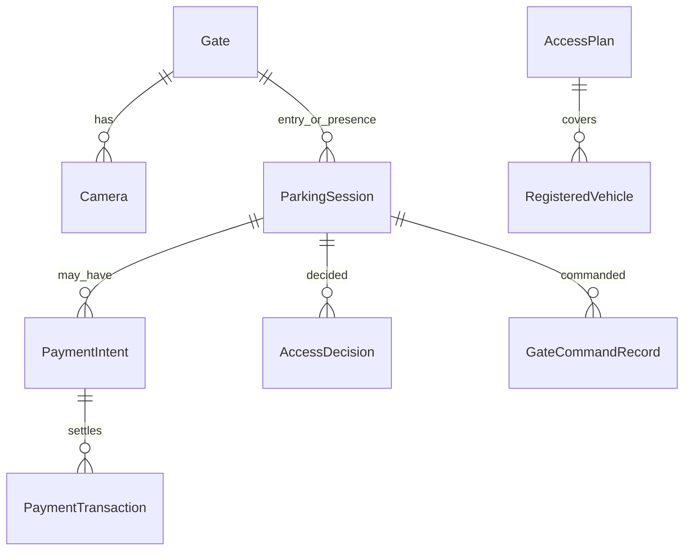

# Domain model

## Purpose

Name the parking objects the Site Server stores.

## What owns this

`app/models.py` (SQLAlchemy). Use-cases in `app/services/simulation.py`, `access.py`, and `app/infrastructure/payments/ledger.py`.

## What it must NOT do

- Introduce a parallel RFID ticket identity
- Let camera/gate vendor packets leak into session rows
- Treat `amount_paid` as the only payment history (it is a derived cache of SUCCEEDED transactions)

## Diagram

## Main data structures

| Entity | Table | Notes |
|---|---|---|
| Gate / Camera | `gates`, `cameras` | Lane is `lane_direction` on the camera. Stream roles live in `cameras.stream_profiles` |
| ParkingSession | `parking_sessions` | Site-wide; A→B exit is valid |
| VehicleCapture | `vehicle_captures` | Image + crop + native plate |
| AccessPlan / RegisteredVehicle | `access_plans`, `registered_vehicles` | Auto-open subscribers |
| Tariff | `tariffs` | Versioned JSON rules (Car1 today) |
| PaymentIntent / PaymentTransaction | `payment_intents`, `payment_transactions` | Unified ledger |
| AccessDecision | `access_decisions` | ENTRY_AUTHORIZED, DENIED_PAYMENT, … |
| GateCommandRecord | `gate_commands` | Unique `command_uuid` |
| Receipt | `receipts` | Convenience, not identity |
| User / Role / AuditLog | `users`, `roles`, `audit_logs` | Server-side RBAC |

Stored session statuses remain `WAITING_RECEIPT`, `ACTIVE`, `PAID`, `OPEN`, `CLOSED`. Names used in domain helpers live in `app/domain/parking.py`.

## Request / event flow

Plate event → entitlement lookup → create session (skip if an open row exists for that plate) → optional print → gate pulse → decision row.

## Failure behavior

Unique plate+open session is enforced in application code (`_active_for_plate`). Payment idempotency is `payment_transactions.idempotency_key`.

## Security

Passwords hashed (Argon2). Camera passwords stay on the server. Public token is high-entropy, not the plate or row id.

## Configuration

Default receipt policy `PRINT_AND_OPEN`. Subscribers default `print_receipt=False`.

## Tests

CRUD, access/receipts, simulation, adapter registry.

## How to extend safely

Add columns with `ensure_schema()` SQLite ALTERs. New entities need indexes on plate, token, provider transaction id.

## Common mistakes

Deleting users who appear on payments/audit. Storing `paid=true` without a transaction.
