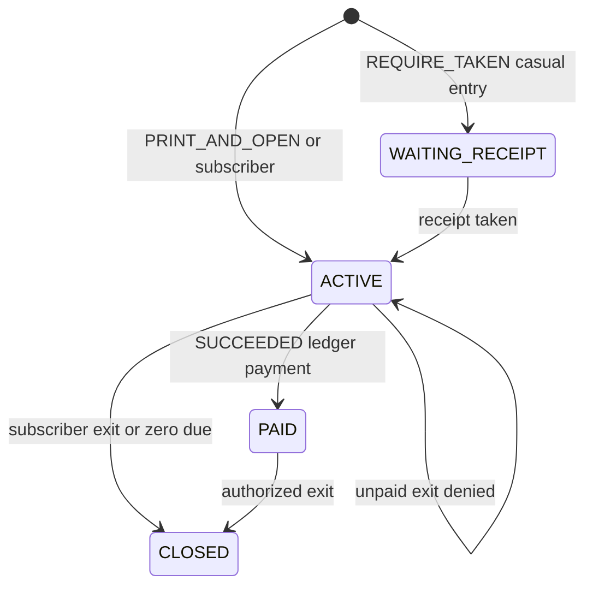

# Session state machine

## Purpose

Define how a parking stay moves from detection to closed, using the values stored in SQLite today.

## What owns this

`app/services/simulation.py` (`handle_plate_event`, `take_receipt`, `mark_paid`, `handle_exit`).

## What it must NOT do

- Derive state only from UI buttons
- Close a session because a receipt was printed
- Open an exit because a public web page said “success”

## Diagram

## Main data structures

| Stored | Meaning |
|---|---|
| WAITING_RECEIPT | Casual held until paper taken (optional policy) |
| ACTIVE | Inside; may owe money |
| PAID | Ledger covers amount due |
| OPEN | Legacy rows treated as inside |
| CLOSED | Left the site |

Open set: `WAITING_RECEIPT`, `ACTIVE`, `PAID`, `OPEN`.

## Request / event flow

**Entry (default PRINT_AND_OPEN):** create session → print the A4/USB (or file) slip → pulse the barrier. A printer hang is time-limited; the boom still opens if print fails. `GET/POST /sessions/{id}/receipt` reprints.

**Entry (REQUIRE_TAKEN_BEFORE_OPEN):** WAITING_RECEIPT until `POST /sessions/{id}/receipt-taken`.

**Exit:** find any open site-wide session for the plate → quote tariff → if entitlement or paid/zero due, pulse exit and CLOSED; else keep closed and show pay prompt.

## Failure behavior

Duplicate entry does not create a second open session. Unpaid casual at either gate stays closed. Decision latency is recorded on `access_decisions.latency_ms` and returned as `latency_ms`.

## Security

Exit authorization reads local committed payment state. No provider call at the boom.

## Configuration

`receipt_policy`, `exit_requires_payment`, `pay_prompt` in `site_settings`.

## Tests

`test_print_and_open_is_default_casual_entry`, `test_require_taken_holds_gate_until_receipt`, `test_unpaid_exit_stays_closed_with_pay_prompt`, `test_paid_exit_opens`.

## How to extend safely

Add a stored status only with a migration and an alias map. Do not rename existing rows in place.

## Common mistakes

Assuming exit must use the same gate as entry. Treating WAITING_RECEIPT as the V1 default (it is optional).
