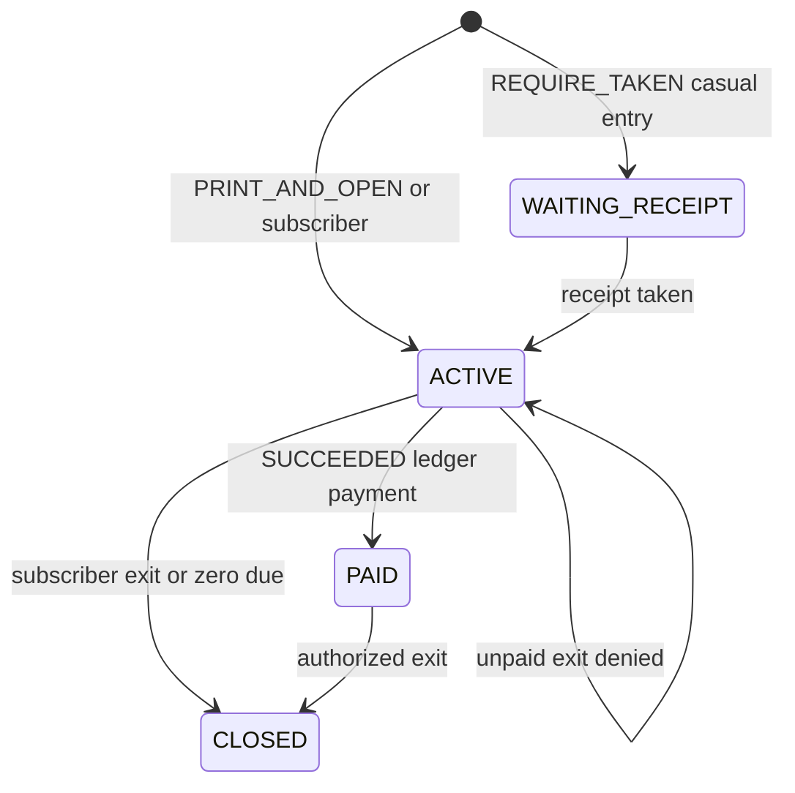

# Session state machine

## Purpose

Define how a parking stay moves from detection to closed. Operator-facing
SQLite `status` values are unchanged. Fine-grained `lifecycle` is the
auditable machine.

## What owns this

- Domain rules: `app/domain/parking_engine.py` (no printers, cameras, or GPIO)
- Persistence: `app/services/parking_sessions.py`
- Live capture path until Phase 4: `app/services/simulation.py`

## What it must NOT do

- Derive state only from UI buttons
- Close a session because a receipt was printed
- Open an exit because a public web page said “success”
- Skip `RECEIPT_TAKEN` when the lane policy is `RECEIPT_REQUIRED_BEFORE_OPEN`
- Treat a gate OPEN command as vehicle passage when `passage_sensing=WAIT_FOR_PASSAGE`

## Diagram

Stored status (operator / reports):


```mermaid
stateDiagram-v2
  [*] --> WAITING_RECEIPT: REQUIRE_TAKEN casual entry
  [*] --> ACTIVE: PRINT_AND_OPEN or subscriber
  WAITING_RECEIPT --> ACTIVE: receipt taken
  ACTIVE --> PAID: SUCCEEDED ledger payment
  ACTIVE --> CLOSED: subscriber exit or zero due
  PAID --> CLOSED: authorized exit
  ACTIVE --> ACTIVE: unpaid exit denied
```

Lifecycle (parking engine):

```text
entry: VEHICLE_DETECTED → IDENTITY_RESOLVED → SESSION_CREATED
     → [RECEIPT_PRINTING → RECEIPT_PRESENTED → RECEIPT_TAKEN]
     → ENTRY_AUTHORIZED → GATE_OPEN_REQUESTED → VEHICLE_PASSED → ACTIVE
exit:  EXIT_VEHICLE_DETECTED → SESSION_RESOLVED → TARIFF_CALCULATED
     → AUTHORIZATION_DECISION → AUTHORIZED | DENIED_PAYMENT_REQUIRED
     → EXIT_GATE_OPEN_REQUESTED → EXIT_VEHICLE_PASSED → CLOSED
```

`SESSION_CREATED → GATE_OPEN_REQUESTED` is rejected when receipts must be taken.
Default passage policy is `OPEN_COMMAND_COUNTS_AS_PASSED` until a loop/photocell
is wired; then set `WAIT_FOR_PASSAGE`.

## Main data structures

| Stored `status` | Meaning |
|---|---|
| WAITING_RECEIPT | Casual held until paper taken (optional policy) |
| ACTIVE | Inside; may owe money |
| PAID | Ledger covers amount due |
| OPEN | Legacy rows treated as inside |
| CLOSED | Left the site |

Open set: `WAITING_RECEIPT`, `ACTIVE`, `PAID`, `OPEN`.

Session is site-wide: `site_id`, `entry_lane_id`, `exit_lane_id`. One open row
per `(site_id, plate)`. Idempotency keys: `entry_event_id`, `exit_event_id`,
`open_command_uuid`.

## Request / event flow

**Engine (Phase 1, tests / future orchestrator):** `start_entry` → policy-driven
`complete_casual_entry` or `mark_receipt_taken` + `request_entry_open` →
`start_exit` / `complete_authorized_exit`. No hardware calls.

**Live path (until Phase 4):** still `handle_plate_event` in `simulation.py`.
Default PRINT_AND_OPEN: create session → print → pulse barrier.
REQUIRE_TAKEN_BEFORE_OPEN: WAITING_RECEIPT until `POST /sessions/{id}/receipt-taken`.
Exit: any open site-wide session for the plate.

## Failure behavior

Duplicate `entry_event_id` or an already-open plate returns the same session.
Unpaid casual at either gate stays `DENIED_PAYMENT_REQUIRED` (engine) / closed
boom (live path). Decision latency is recorded on `access_decisions.latency_ms`.

## Security

Exit authorization reads local committed payment state. No provider call at the boom.

## Configuration

`receipt_policy`, `exit_requires_payment`, `pay_prompt` in `site_settings`.
LanePolicy: `receipt_required_before_open`, `passage_sensing`.

## Tests

`tests/test_parking_engine.py` plus
`test_print_and_open_is_default_casual_entry`, `test_require_taken_holds_gate_until_receipt`,
`test_unpaid_exit_stays_closed_with_pay_prompt`, `test_paid_exit_opens`.

## How to extend safely

Add a stored status only with a migration and an alias map. Do not rename existing rows in place.
Lifecycle names may grow; map them through `stored_status_for`.

## Common mistakes

Assuming exit must use the same gate as entry. Treating WAITING_RECEIPT as the V1 default (it is optional). Putting printer or HVX calls in `parking_engine.py`.
