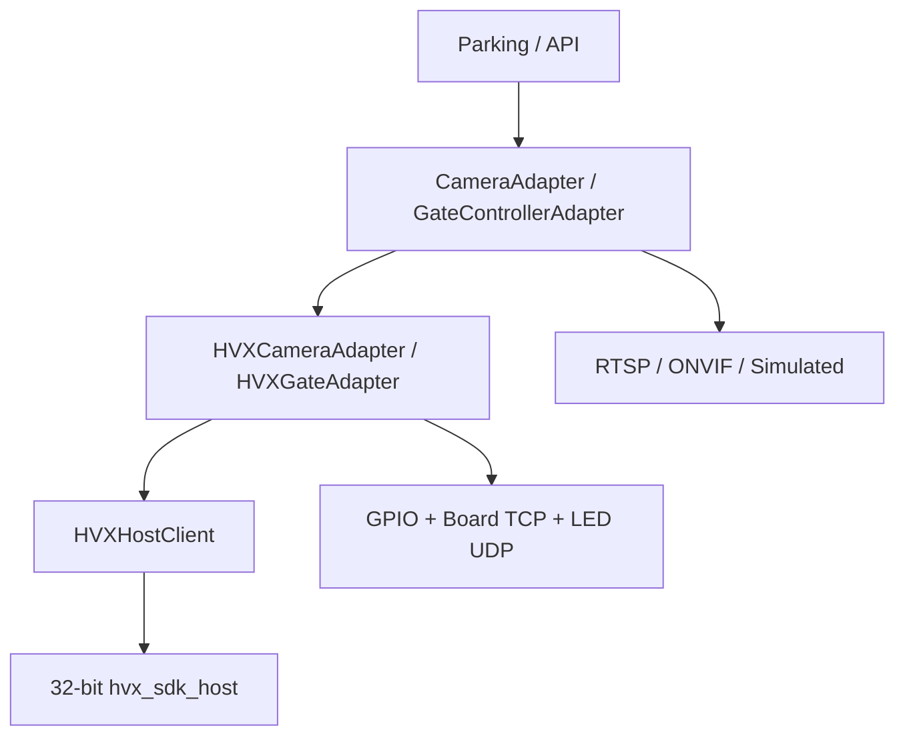

# Hardware adapter architecture

## Purpose

Let parking, tariff, and payment code talk to cameras and barriers through adapters, without replacing the HVX host or GPIO path.

## What this must NOT do

- Move or rewrite `tools/hvx_sdk_host/`
- Make ONVIF/RTSP the default camera path
- Introduce a second device database
- Put production lanes in SHADOW by default
- Stop parking services from reaching the HVX host through the wrap

## Boundary

Default `adapter_id` is `hvx`. Unknown adapter ids fall back to HVX.

RTSP remains Probe RTSP / optional media. ONVIF is a registered stub that cannot report `SDK_CONNECTED`. `live_sources()` tells the live pump whether to stay on NetSDK video or optional RTSP.

Adding a vendor: [10-ADDING-A-NEW-CAMERA-VENDOR.md](10-ADDING-A-NEW-CAMERA-VENDOR.md).

## Device registry

`GET /devices` projects existing `cameras` and `gates` rows (plus Board*/LED IPs). No new table.

## Connection mode

`DIRECT` is the live path. `EDGE_AGENT` is reserved and refused on SDK connect.

## Lane modes

| Mode | Automatic boom pulse | Manual Hardware Lab |
|---|---|---|
| COMMISSIONING (default) | Yes | Yes |
| PRODUCTION | Yes | Yes |
| SHADOW | No (`dry_run`) | Yes |
| MAINTENANCE | No (`dry_run`) | Yes |
