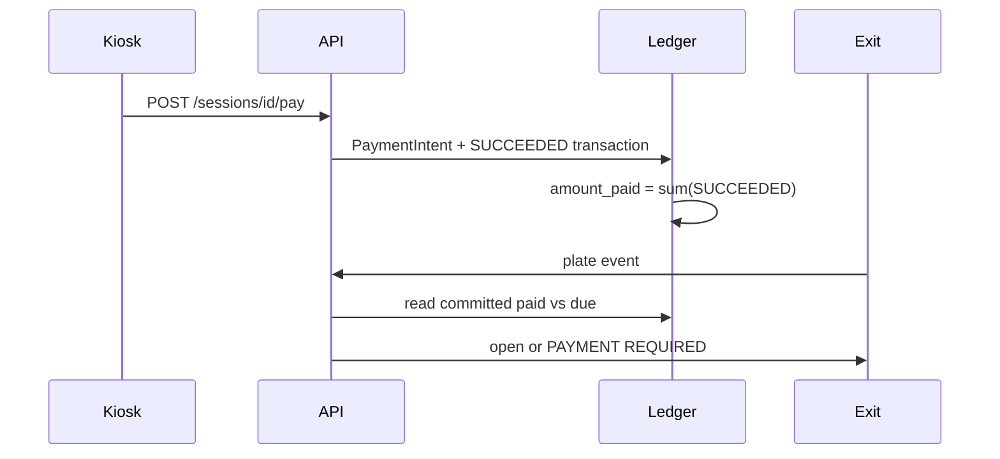

# Payment architecture

## Purpose

One ledger for kiosk cash (now) and mobile money (later). Gate authorization reads local SUCCEEDED totals, not a provider round-trip at the barrier.

## What owns this

`app/infrastructure/payments/ledger.py` writes rows. `ManualKioskPaymentProvider` / `SimulatedPaymentProvider` are seams. `mark_paid` is the kiosk confirmation path.

## What it must NOT do

- Set session paid from a public browser POST without a verified provider callback
- Keep a separate cash database
- Call a payment API during entry
- Treat `PaymentProvider.verify_callback` as paid unless the ledger insert succeeded

## Diagram

## Main data structures

Statuses: CREATED, PENDING, SUCCEEDED, FAILED, EXPIRED (refunds later). Methods include `KIOSK_CASH`. Idempotency key `session:{id}:settle` for kiosk settle.

## Request / event flow

Quote fee → insert intent + transaction → recompute `amount_paid` / `PAID` → audit. Duplicate key returns the existing transaction.

## Failure behavior

Internet down: kiosk cash still works; do not invent mobile SUCCEEDED. Provider retries must hit the unique key.

## Security

`payments.create` / `kiosk.use` required. Public `/p/{token}` shows due amount only.

## Configuration

No live Tanzania aggregator in V1. Plug in a provider that implements `create_intent`, `initiate_collection`, `verify_callback`, `query_status`.

## Tests

`test_kiosk_payment_writes_ledger`, `test_paid_exit_opens`.

## How to extend safely

On verified webhook, call `record_succeeded_payment` with the provider transaction id. Never trust the redirect URL.

## Common mistakes

Marking PAID in JavaScript. Skipping amount/session checks on callbacks.
