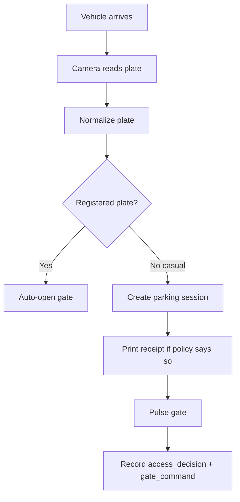
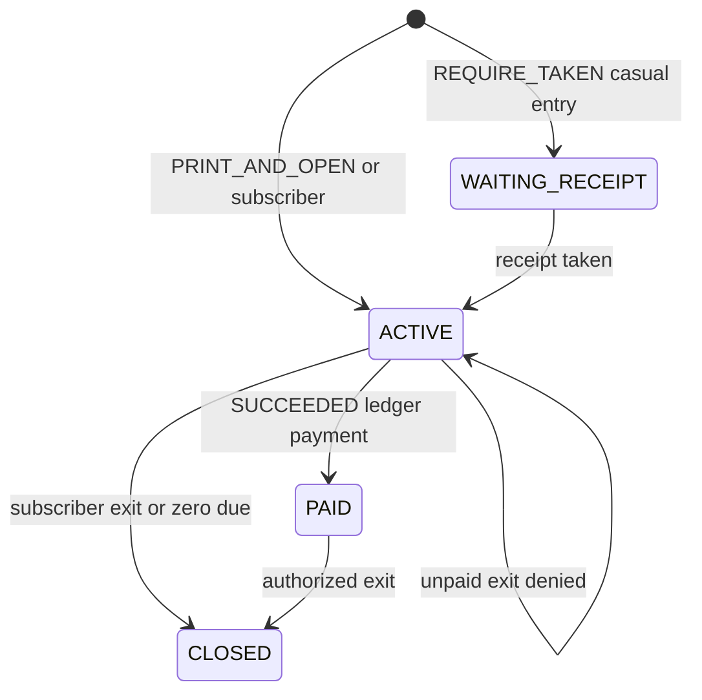

# SmartPark Edge — Comprehensive Project Guide

This document explains **everything** about the SmartPark Edge project: what it is, the technology stack, how the pieces fit together, how data flows, and how to run, extend, and deploy it. It is written for developers, operators, and architects who need a single reference.

For day-to-day navigation of the existing doc set, start with [00-START-HERE.md](00-START-HERE.md). For a shorter overview, see [README.md](../README.md) and [ARCHITECTURE.md](../ARCHITECTURE.md).

---

## Table of contents

1. [What SmartPark Edge is](#1-what-smartpark-edge-is)
2. [Technology stack](#2-technology-stack)
3. [Platform support matrix](#3-platform-support-matrix)
4. [Repository layout](#4-repository-layout)
5. [Process architecture](#5-process-architecture)
6. [Application layers](#6-application-layers)
7. [Core parking flow](#7-core-parking-flow)
8. [Session state machine](#8-session-state-machine)
9. [Hardware adapters](#9-hardware-adapters)
10. [HVX SDK host (32-bit sidecar)](#10-hvx-sdk-host-32-bit-sidecar)
11. [Media and ALPR pipelines](#11-media-and-alpr-pipelines)
12. [Payment architecture](#12-payment-architecture)
13. [Database schema](#13-database-schema)
14. [REST API reference](#14-rest-api-reference)
15. [Security and RBAC](#15-security-and-rbac)
16. [Configuration and environment variables](#16-configuration-and-environment-variables)
17. [Entry points and how to run](#17-entry-points-and-how-to-run)
18. [Packaging and deployment](#18-packaging-and-deployment)
19. [Testing](#19-testing)
20. [Module system](#20-module-system)
21. [Extension points](#21-extension-points)
22. [Architectural decisions (ADRs)](#22-architectural-decisions-adrs)
23. [What not to change (the working engine)](#23-what-not-to-change-the-working-engine)
24. [Known gaps and future work](#24-known-gaps-and-future-work)
25. [Full documentation index](#25-full-documentation-index)

---

## 1. What SmartPark Edge is

SmartPark Edge is a **plate-first parking operating system** that runs on-site at a parking facility. It:

- Reads vehicle number plates from cameras (native HVX SDK callbacks or local FastALPR OCR)
- Creates and manages **parking sessions** keyed by normalized plate
- Applies **tariffs** and **access plans** (season, VIP, staff, contractor)
- Prints thermal receipts for casual parkers
- Opens or holds **barriers** based on entitlement and payment state
- Records an **immutable payment ledger** for kiosk cash and future mobile money
- Provides operator UIs (Windows desktop or browser) and a tokenized public payment page

### Core product principles

| Principle | Meaning |
|-----------|---------|
| Plate is identity | The normalized plate is the authoritative identity — not a receipt, QR code, or RFID tag |
| Hardware behind adapters | Cameras, gates, and printers plug in via adapter interfaces; parking logic never calls vendor SDKs directly |
| Site must keep running | One dead camera, closed UI, or missing OCR must not stop the rest of the site |
| Local authority | Gate decisions read committed local payment state; no provider round-trip at the boom |
| Modular monolith | One API process owns parking, sessions, and hardware orchestration |

### What it does

- SDK login on port 30000, live JPEG, native plate callbacks (Windows + HVX host)
- Connect-all skips dead cameras so the rest still log in
- Registered plates open the gate automatically; casuals print then open (default policy)
- USB thermal receipt printing from Settings; Simulation uses the same printer path
- Site-wide sessions (enter at gate 1, leave at gate 2 is valid)
- System health, bounded queues, logon tasks for Site Service + HVX host
- Roles: Admin, Operator, Kiosk Operator

### What it does not do

- Treat ping, HTTP 80, or RTSP-open as "camera connected" for HVX
- Load `NetSDK.dll` in 64-bit Python or on Linux
- Run FastALPR on every live frame
- Mark mobile payment paid from a browser success page alone
- Require PostgreSQL, Edge Agents, or ONVIF for the current site
- Emulate a vendor SoftDog USB license dongle
- Run the PySide desktop on Linux/macOS

---

## 2. Technology stack

### Backend

| Technology | Version / notes | Role |
|------------|-----------------|------|
| **Python** | 3.11+ | Primary language for Site Service, services, and adapters |
| **FastAPI** | ≥0.116 | REST API framework (`app/api_main.py`) |
| **Uvicorn** | ≥0.35 | ASGI server for the Site Service |
| **SQLAlchemy** | 2.x | ORM for all database tables |
| **Pydantic** | 2.x | Request/response validation and settings |
| **httpx** | ≥0.28 | Async HTTP client to the HVX SDK host |
| **argon2-cffi** | ≥23.1 | Password hashing (Argon2) |

### Database

| Technology | Role |
|------------|------|
| **SQLite** | Default live store (`{data_dir}/smartpark.db`) |
| **PostgreSQL** | Optional via `SMARTPARK_DATABASE_URL` (models ready; not required today) |

### Desktop client

| Technology | Role |
|------------|------|
| **PySide6** | Qt-based Windows desktop operator UI (`app/desktop/`) |

### Web client

| Technology | Role |
|------------|------|
| **Static HTML/JS** | Single-page operator UI served by FastAPI at `GET /` (`app/web/index.html`) |

### Camera SDK

| Technology | Role |
|------------|------|
| **32-bit Python + ctypes** | `tools/hvx_sdk_host/` loads `NetSDK.dll` (PE32) |
| **HTTP sidecar** | Host listens on `127.0.0.1:8765`; Site Service talks via `HVXHostClient` |

### Recognition (OCR)

| Technology | Role |
|------------|------|
| **FastALPR + ONNX** | Local plate OCR for generic IP cameras |
| **ONNX Runtime** | Inference engine for FastALPR models |
| **OpenCV (headless)** | JPEG contrast boost for OCR only — not in the live decode loop |
| **Pillow, NumPy** | Image handling |

### Receipts and payments

| Technology | Role |
|------------|------|
| **qrcode** | QR code generation on thermal receipts |
| **ESC/POS** | USB thermal (58/80 mm) or LAN thermal printer protocol |

### Optional media

| Technology | Role |
|------------|------|
| **FFmpeg** | RTSP ingest for generic IP cameras (must be on PATH) |
| **MediaMTX** | Optional RTSP sidecar (`vendor/mediamtx/`) for advanced streaming |

### Testing

| Technology | Role |
|------------|------|
| **unittest** | Test runner (`python -m unittest discover -s tests`) |
| **pytest config** | `pyproject.toml` sets `pythonpath = ["."]` |

### Packaging

| Technology | Role |
|------------|------|
| **Embedded Python** | Windows USB kit ships 32-bit + 64-bit embeddable Python |
| **PowerShell / Bash** | Install scripts, dev launchers, kit builder |

---

## 3. Platform support matrix

| Component | Windows | Linux / macOS |
|-----------|---------|---------------|
| Site Service (API + parking logic) | Yes | Yes |
| Browser UI (`http://127.0.0.1:8760`) | Yes | Yes |
| Desktop (PySide6) | Yes | Yes |
| HVX NetSDK host (port 30000 cameras) | Yes (32-bit) | No |
| Generic IP cams (`rtsp` / `dahua` / `hikvision`) | Yes | Yes + FastALPR |
| USB thermal receipt printer | Yes | Limited (LAN ESC/POS works) |
| GPIO + Board* TCP + LED UDP gates | Yes (via HVX host) | No |

Platform detection lives in `app/services/platform_capabilities.py`:

- `hvx_host_supported()` — true only on Windows
- `recommended_client()` — `"desktop"` on Windows and Linux
- `recommended_camera_adapter()` — `"hvx"` on Windows, `"rtsp"` elsewhere

---

## 4. Repository layout

```
smartpark_edge_rebuild/
├── app/                          # Main application
│   ├── api_main.py               # FastAPI REST API (~100 routes)
│   ├── site_service.py           # Production Site Service entry point
│   ├── models.py                 # SQLAlchemy ORM models (18 tables)
│   ├── db.py                     # Engine, sessions, schema migrations
│   ├── config.py                 # Settings from SMARTPARK_* env vars
│   ├── schemas.py                # Pydantic DTOs
│   ├── security.py               # Argon2, bearer tokens, RBAC
│   ├── cli.py                    # CLI: create admin, reset password
│   ├── media_service.py          # Optional MediaMTX owner process
│   ├── recognition_worker.py     # Optional FastALPR DETECT consumer
│   ├── domain/                   # Protocols and domain types (no vendor code)
│   ├── application/              # Use-case wrappers
│   ├── infrastructure/           # Hardware/payment/recognition adapters
│   ├── services/                 # Working engine (~50 modules)
│   ├── core/                     # Plate normalization and ALPR fusion
│   ├── desktop/                  # PySide6 Windows client
│   ├── web/                      # Browser UI + launch
│   └── i18n/                     # Translation helper
├── tools/hvx_sdk_host/           # 32-bit Windows NetSDK sidecar (DO NOT REWRITE)
├── docs/                         # Product and technical documentation (52+ files)
├── docs-site/                    # Static docs viewer (HTML/JS)
├── tests/                        # 25 unittest files
├── scripts/                      # Dev and ops launch scripts
├── packaging/                    # Windows USB install kit builder
├── config/                       # default.env.example
├── models/fastalpr/              # ONNX models for local OCR
├── vendor/mediamtx/              # Bundled MediaMTX config
├── OcxConfig/                    # HVX vendor DLLs (when present on site PC)
├── requirements.txt              # Python dependencies
├── pyproject.toml                # Project metadata (name, version, pytest)
├── README.md                     # Quick start
├── ARCHITECTURE.md               # High-level architecture
└── CONTRIBUTING.md               # Contributor guide
```

---

## 5. Process architecture

SmartPark Edge is a **modular monolith** with optional sidecar processes:

```text
Operator (Desktop on Windows, or browser on any OS)
          |
          | HTTP 127.0.0.1:8760
          v
   Site Service  (FastAPI, SQLite, parking, receipts)  ← any OS
          |
          | HTTP 127.0.0.1:8765
          v
   HVX SDK Host  (32-bit Python + NetSDK.dll)  ← Windows only
          |
          v
   Cameras (port 30000)  +  Board* TCP  +  LED UDP
```

### Why the SDK is a separate process

The vendor library (`NetSDK.dll`) is **32-bit Windows only**. The UI and API run as **64-bit**. Isolating the SDK means:

- A camera crash does not take down parking logic
- Linux/macOS can still run the API and browser UI
- The 32-bit host stays ctypes-only (no FastAPI, PySide, or FastALPR inside it)

### Processes

| Process | Port | Role | OS |
|---------|------|------|-----|
| Site Service | 8760 | API, events, receipts, sessions | Any |
| Browser UI | (served by Site Service) | Operator client | Any |
| Desktop | (calls API on 8760) | Operator client | Windows only |
| HVX SDK Host | 8765 | NetSDK connect, live JPEG, GPIO | Windows x86 |

On Windows, the installer can register Site Service and HVX host as logon scheduled tasks.

### Startup order (Windows desktop)

1. `desktop/launch.py` → `start_hvx_host()` (32-bit `python32`)
2. `start_site_service()` → `python -m app.site_service` (separate process)
3. Wait for `/health/live` on port 8760
4. Launch `desktop/main.py` (Qt UI calling API via `desktop/api.py`)

### Startup order (Linux / web)

1. `web/launch.py` or `./scripts/run_dev_linux.sh`
2. Site Service starts (HVX host skipped on non-Windows)
3. Browser opens to `http://127.0.0.1:8760`

---

## 6. Application layers

### `app/domain/` — protocols and contracts

Pure domain types and adapter protocols. **No vendor SDK calls.**

| Module | Purpose |
|--------|---------|
| `cameras.py` | `CameraAdapter` contract (connect, snapshot, live_sources, capabilities) |
| `gates.py` | Gate adapter contract; COMMISSIONING / SHADOW / PRODUCTION modes |
| `parking.py` | Session state aliases |
| `recognition.py` | Normalized plate event contract |
| `media.py` | Media subsystem contract |
| `events.py` | Typed domain events (`plate_recognized`, etc.) |
| `modules.py` | Product modules and deployment profiles |
| `flags.py` | Safe-migration feature flags |
| `site.py` | Site identity, locale, timezone, currency |
| `devices.py` | `DeviceRecord`, adapter IDs, connection modes |

### `app/application/` — use cases

Thin wrappers that delegate to services. Does not own HVX or GPIO.

| Module | Purpose |
|--------|---------|
| `parking.py` | Parking use-cases delegating to `simulation.py` |

### `app/infrastructure/` — adapters

Hardware and payment implementations that wrap the working engine.

| Area | Modules | Purpose |
|------|---------|---------|
| **Cameras** | `hvx.py`, `rtsp.py`, `onvif.py`, `simulated.py` | Camera vendor adapters |
| **Gates** | `hvx.py`, `simulated.py` | Gate adapters wrapping `PhysicalGateController` |
| **Printers** | `printers.py` | Simulated, ESC/POS LAN, Windows USB thermal |
| **Recognition** | `fastalpr.py`, `native_hvx.py` | OCR provider adapters |
| **Payments** | `ledger.py`, providers | Immutable payment ledger |
| **Registry** | `registry.py` | Projects Camera/Gate rows → device list |

### `app/services/` — working engine

The live parking, media, and hardware orchestration layer (~50 modules). Critical modules:

| Module | Purpose |
|--------|---------|
| `hvx_client.py` | Async HTTP client to 32-bit host (`HVXHostClient`) |
| `gates.py` | Open lane: camera GPIO + Board* TCP + LED UDP |
| `simulation.py` | Plate event → session → receipt → gate (`handle_plate_event`) |
| `fee_engine.py` | Car1 tariff calculation |
| `receipts.py` | Issue/store receipts; QR + printer payload |
| `public_pay.py` | Public QR payment page helpers |
| `access.py` | Access plans and registered plates (auto-open) |
| `decisions.py` | Persist access decisions and gate command records |
| `alpr.py` | Local FastALPR boundary (ONNX) |
| `ocr_policy.py` | Native-first vs FastALPR fallback fusion |
| `media_gateway.py` | One upstream producer per camera; consumers attach |
| `preview.py` | Live MJPEG/JPEG for UI |
| `site_cameras.py` | Lane layout, discovery rows, canonical site cameras |
| `captures.py` | Persist snapshot + plate crop + characters |
| `health.py` | `/health/live`, `/health/ready`, `/health/details` |
| `bootstrap.py` | First-run admin (`admin` / `SmartPark1!`) |
| `platform_capabilities.py` | OS capability snapshot |

### `app/core/` — shared algorithms

| Module | Purpose |
|--------|---------|
| `plate.py` | Country-neutral plate normalization and validation |
| `fusion.py` | Fuse native HVX ALPR + local FastALPR readings |

### `app/desktop/` — Windows PySide6 client

| Module | Purpose |
|--------|---------|
| `launch.py` | Windows entry: spawn HVX host + Site Service + desktop |
| `main.py` | Operator UI: live gates, sessions, vehicles, tariffs, health |
| `desk.py` | Reports, backup, and plain-language health text |
| `api.py` | Sync httpx wrapper for local API |
| `theme.py` | Dark/light Qt styles |

### `app/web/` — multiplatform browser UI

| Module | Purpose |
|--------|---------|
| `launch.py` | Start Site Service + open browser (any OS) |
| `index.html` | Single-page operator UI served by FastAPI |

---

## 7. Core parking flow



### Step-by-step

1. **Plate detection** — from native HVX callback, coil GPIO rising edge, or FastALPR on RTSP frame
2. **Normalize plate** — uppercase alphanumeric per `plate_normalization` setting
3. **Entitlement lookup** — check `registered_vehicles` + `access_plans`
4. **Short SQLite transaction** — create or update `parking_sessions` row
5. **Receipt** — print thermal ticket if policy requires (`PRINT_AND_OPEN` default)
6. **Gate pulse** — GPIO + Board* TCP + LED UDP via `GateController` (unless SHADOW mode)
7. **Audit** — write `access_decisions` and `gate_commands` rows

### Exit flow

1. Plate read at any exit gate
2. Find open site-wide session for that plate
3. Quote tariff (Car1 rules from `tariffs` table)
4. If subscriber, zero due, or `amount_paid >= amount_due` → pulse exit gate, set CLOSED
5. Else → deny exit, show pay prompt

### Connection states (cameras)

```text
UNKNOWN → DISCOVERED → SDK_CONNECTING → SDK_CONNECTED
                              └→ SDK_FAILED
```

`SDK_CONNECTED` means `Net_ConnCameraEx` returned `0` on port **30000**. Ping and HTTP 80 are **not** a login.

---

## 8. Session state machine

Owned by `app/services/simulation.py`.



| Status | Meaning |
|--------|---------|
| `WAITING_RECEIPT` | Casual held until paper taken (optional policy) |
| `ACTIVE` | Inside; may owe money |
| `PAID` | Ledger covers amount due |
| `OPEN` | Legacy rows treated as inside |
| `CLOSED` | Left the site |

**Open set:** `WAITING_RECEIPT`, `ACTIVE`, `PAID`, `OPEN`.

### Receipt policies

| Policy | Behavior |
|--------|----------|
| `OFF` | No receipt |
| `PRINT_OPTIONAL` | Print if printer available |
| `PRINT_AND_OPEN` | Print then open (default for casuals) |
| `REQUIRE_TAKEN_BEFORE_OPEN` | Hold gate until `POST /sessions/{id}/receipt-taken` |

---

## 9. Hardware adapters

Parking code talks to hardware only through adapters. Unknown `adapter_id` falls back to `hvx`.

### Camera adapters (`app/infrastructure/hardware/cameras/`)

| Adapter ID | Class | Use case |
|------------|-------|----------|
| `hvx` (default) | `HVXCameraAdapter` | HVX/QY NetSDK cameras via 32-bit host |
| `rtsp` | `RTSPCameraAdapter` | Dahua, Hikvision, generic IP cams + FastALPR |
| `onvif` | `ONVIFCameraAdapter` | Placeholder for future vendors |
| `simulated` | `SimulatedCameraAdapter` | Tests only |

Generic IDs (`dahua`, `hikvision`, `ipcam`) resolve to `rtsp`.

**CameraAdapter contract:** `connect`, `snapshot`, `live_sources`, `capabilities`

### Gate adapters (`app/infrastructure/hardware/gates/`)

| Adapter | Behavior |
|---------|----------|
| `hvx` | Wraps `PhysicalGateController` (GPIO + Board* + LED) |
| `simulated` | Dry-run for tests |

**Gate modes:**

| Mode | Behavior |
|------|----------|
| `COMMISSIONING` | Physical opens allowed (default) |
| `SHADOW` | Dry-runs automatic opens only |
| `PRODUCTION` | Normal operation |

**Actuators** (via `app/services/gates.py`):

- **HVX GPIO pulse** — camera GPIO pin via SDK host
- **Board* TCP** — `app/services/board_tcp.py` (port 5000 default)
- **LED UDP** — `app/services/led_udp.py` (LEDSender2010 protocol)

### Printer adapters (`app/infrastructure/hardware/printers.py`)

| Adapter ID | Behavior |
|------------|----------|
| `simulated` | Store slip only (default) |
| `escpos` | LAN thermal ESC/POS (port 9100) |
| `system` / `usb` / `thermal` | Windows system/USB printer |

Receipt is always stored in the database regardless of print success.

---

## 10. HVX SDK host (32-bit sidecar)

Location: `tools/hvx_sdk_host/`

```
tools/hvx_sdk_host/
├── hvx_host.py          # ThreadingHTTPServer on 127.0.0.1:8765
├── hvx_sdk.py           # ctypes bindings to NetSDK.dll
├── hvx_bindings.json    # Function signatures
├── run_hvx_host.bat     # Windows launcher
└── vendor/              # Fallback DLL directory
```

**Requirements:** 32-bit Windows Python; PE32 DLLs from `OcxConfig/` (or `SMARTPARK_HVX_VENDOR_DIR`).

### SDK connect sequence

```text
Net_Init → Net_AddCamera → Net_RegReportMessEx → Net_ConnCameraEx (port 30000)
    → Net_RegImageRecvEx → Net_StartVideo → Net_GetJpgBuffer (live JPEG)
```

### Host HTTP API

| Method | Path | Purpose |
|--------|------|---------|
| GET | `/info` | DLL inventory, python bits |
| GET | `/captures` | Last native captures |
| GET | `/events/{handle}` | Drain plate events |
| GET | `/live-jpeg/{handle}` | Latest live JPEG |
| GET | `/gpio/{handle}` | Read GPIO pin |
| GET | `/state/{handle}` | Connection state |
| POST | `/connect` | Full SDK connect sequence |
| POST | `/disconnect/{handle}` | Disconnect camera |
| POST | `/discover` | Net_FindDeviceIp |
| POST | `/gpio/pulse` | Open barrier pulse |
| POST | `/gpio/write` | Write GPIO state |

The Site Service calls these via `app/services/hvx_client.py` (`HVXHostClient`).

---

## 11. Media and ALPR pipelines

### Design principle

**One upstream producer per camera.** Live view and FastALPR are **consumers** of latest-frame buffers. FastALPR is **not** in the live decode loop.

```text
Camera (HVX JPEG or FFmpeg RTSP)
    → MediaGateway (one producer)
        → LatestFrameBuffer (LIVE role)
        → LatestFrameBuffer (DETECT role)
            → FastALPR worker (optional, at detect_fps)
        → Preview/MJPEG endpoint (UI consumer)
```

### Stream roles

| Role | Purpose |
|------|---------|
| `MAIN` | High-res evidence |
| `SUB` | Lower-res substream |
| `LIVE` | Operator live view |
| `DETECT` | ALPR sampling |
| `EVIDENCE` | Snapshot archive |

### ALPR modes

| Source | When used |
|--------|-----------|
| **Native HVX** | HVX cameras on Windows — plate callbacks from SDK |
| **FastALPR** | Generic IP cameras — ONNX local OCR on DETECT frames |
| **Fusion** | `ocr_policy.py` merges native + local when both available |

Settings: `SMARTPARK_ALPR_MODE` (default `NATIVE_ONLY`), `SMARTPARK_NATIVE_ALPR_ENABLED`, `SMARTPARK_RECOGNITION_PIPELINE`.

### Optional MediaMTX

`vendor/mediamtx/` provides an optional RTSP sidecar for advanced streaming. Controlled by `SMARTPARK_MEDIA_GATEWAY_ENABLED`. Not required for the current HVX site.

---

## 12. Payment architecture

**Authority:** `payment_transactions` with status `SUCCEEDED` — not browser success screens.

### Components

| Component | Location | Role |
|-----------|----------|------|
| Ledger | `app/infrastructure/payments/ledger.py` | `record_succeeded_payment()`, idempotency |
| Kiosk provider | `ManualKioskPaymentProvider` | Operator-confirmed cash |
| Simulated mobile | `SimulatedPaymentProvider` | Dev/test mobile payment |
| Public page | `app/services/public_pay.py` | `/p/{token}` helpers |

### Payment flow

```text
Entry plate → OPEN session → quote fee → issue receipt (public_token)
    ↓
Driver pays via:
  • POST /sessions/{id}/pay          (kiosk operator)
  • POST /p/{token}/pay              (simulated mobile)
  • POST /p/{token}/kiosk-pay        (operator scans QR)
    ↓
Ledger: PaymentIntent + PaymentTransaction (SUCCEEDED)
    ↓
amount_paid = sum(SUCCEEDED transactions); status → PAID when fully paid
    ↓
Exit plate → check amount_paid vs amount_due → open gate or PAYMENT REQUIRED
```

Receipt QR encodes `/p/{public_token}` (absolute if `SMARTPARK_PUBLIC_BASE_URL` is set).

### Idempotency

Kiosk settle uses key `session:{id}:settle`. Duplicate calls return the existing transaction.

---

## 13. Database schema

**Engine:** SQLite default at `{data_dir}/smartpark.db`; PostgreSQL via `SMARTPARK_DATABASE_URL`.

**Schema management:** `app/db.py` `ensure_schema()` — `create_all` plus SQLite `ALTER TABLE` for columns added after first deploy.

### Tables

| Table | Key fields / purpose |
|-------|----------------------|
| `users` | username, password_hash (Argon2), status |
| `roles` | name, permissions_csv, system_role |
| `user_roles` | user_id, role_id |
| `auth_sessions` | user_id, token_hash, expires_at |
| `sites` | name, timezone, locale, currency |
| `zones` | site_id, name |
| `gates` | name, mode, site_id, zone_id |
| `lanes` | gate_id, direction, bidirectional |
| `cameras` | ip, sdk_port, adapter_id, rtsp_url, stream_profiles, gate_id, status, recognition_mode |
| `parking_sessions` | plate, gate_id, status, entry/exit times, amount_due/paid, public_token |
| `vehicle_captures` | camera_id, plate, confidence, snapshot/crop paths, source |
| `access_plans` | name, kind, auto_open, print_receipt |
| `registered_vehicles` | plate, owner_name, plan_id, valid_from/until |
| `tariffs` | name, car_type, currency, rules (JSON), active |
| `receipts` | session_id, public_token, body_text, qr_payload, status |
| `access_decisions` | plate, gate_id, outcome, barrier_opened, latency_ms |
| `gate_commands` | command_uuid, gate_id, reason, dry_run, ok |
| `payment_intents` | session_id, method, amount, status, idempotency_key |
| `payment_transactions` | intent_id, session_id, provider_transaction_id, status (immutable) |
| `site_settings` | key (PK), value (JSON) — parking policy, migration flags |
| `audit_logs` | user_id, action, target_type/id, detail |

### Data directory

| OS | Path |
|----|------|
| Windows | `%PROGRAMDATA%\SmartParkEdge\` |
| Linux | `~/.local/share/smartpark-edge/` |

---

## 14. REST API reference

**Base URL:** `http://127.0.0.1:8760` (default)

**~100 routes.** Most require bearer auth + RBAC permission.

### Health and static

| Method | Path | Purpose |
|--------|------|---------|
| GET | `/` | Serve web UI |
| GET | `/health` | Basic health |
| GET | `/health/live` | Liveness probe |
| GET | `/health/ready` | Readiness (DB, HVX host) |
| GET | `/health/details` | Detailed subsystem health |

### Auth

| Method | Path | Purpose |
|--------|------|---------|
| GET | `/auth/setup` | First-run setup status |
| POST | `/auth/login` | Username/password login |
| POST | `/auth/token` | OAuth2 token |
| POST | `/auth/logout` | Invalidate session |
| GET | `/auth/me` | Current user + permissions |

### Cameras and devices

| Method | Path | Purpose |
|--------|------|---------|
| GET | `/cameras` | List cameras |
| GET | `/cameras/discover` | LAN discovery |
| POST | `/cameras/sdk/connect-all` | SDK-connect all |
| POST | `/cameras/{id}/sdk/connect` | SDK login (port 30000) |
| GET | `/cameras/{id}/live.mjpeg` | MJPEG live stream |
| GET | `/cameras/{id}/snapshot.jpg` | Cached snapshot |
| POST | `/cameras/onboard/probe` | Universal onboarding probe |

### Gates and lanes

| Method | Path | Purpose |
|--------|------|---------|
| GET | `/gates` | List gates |
| POST | `/gates/{id}/open` | Manual gate open |
| GET | `/lanes/status` | Lane status for dashboard |
| GET | `/captures` | Recent vehicle captures |

### Parking and sessions

| Method | Path | Purpose |
|--------|------|---------|
| POST | `/sessions` | Create/open session |
| POST | `/sessions/{id}/exit` | Close session at exit |
| GET | `/sessions` | List sessions |
| POST | `/sessions/{id}/receipt` | Issue receipt (+ print) |
| POST | `/sessions/{id}/pay` | Kiosk payment |

### Public payment (no auth)

| Method | Path | Purpose |
|--------|------|---------|
| GET | `/p/{token}` | Public payment HTML page |
| GET | `/p/{token}/status` | Public session status JSON |
| POST | `/p/{token}/pay` | Simulated mobile payment |
| POST | `/p/{token}/kiosk-pay` | Operator-confirmed kiosk cash |

### Simulation

| Method | Path | Purpose |
|--------|------|---------|
| POST | `/sim/entry` | Simulate entry plate event |
| POST | `/sim/exit` | Simulate exit |
| POST | `/sim/sessions/{id}/pay` | Sim payment |

### Admin

| Method | Path | Purpose |
|--------|------|---------|
| GET | `/dashboard` | Operator dashboard |
| GET/POST | `/vehicles` | Registered plates |
| GET/POST | `/access-plans` | Season/VIP plans |
| GET/POST | `/users` | User management |
| GET | `/audit` | Recent audit log |

Full route list is in `app/api_main.py`.

---

## 15. Security and RBAC

### Authentication

- Passwords hashed with **Argon2** (`argon2-cffi`)
- Bearer token sessions in `auth_sessions` table
- Bootstrap admin: `admin` / `SmartPark1!` (configurable via env)

### Roles

| Role | Typical permissions |
|------|---------------------|
| Admin | Full system access |
| Operator | Cameras, gates, sessions, dashboard |
| Kiosk Operator | Sessions, payments, receipts |

Permissions enforced via `app/security.py` `require()` dependency on API routes.

### Security rules

- Camera passwords live behind `credentials_ref` (SecretStore); `camera_dict` returns only `password_configured` and a redacted `rtsp_url`
- Public `/p/{token}` shows due amount only — **cannot open barriers**
- Manual gate opens are audited in `gate_commands` and `audit_logs`
- GPIO routes are not exposed on the public host

---

## 16. Configuration and environment variables

All settings use prefix `SMARTPARK_` and are defined in `app/config.py`. Optional `.env` file supported. Example: `config/default.env.example`.

### Core

| Variable | Default | Purpose |
|----------|---------|---------|
| `SMARTPARK_API_HOST` | `127.0.0.1` | Site Service bind |
| `SMARTPARK_API_PORT` | `8760` | Site Service port |
| `SMARTPARK_DATABASE_URL` | (SQLite in data dir) | Optional PostgreSQL |
| `SMARTPARK_HVX_HOST_URL` | `http://127.0.0.1:8765` | 32-bit SDK host |
| `SMARTPARK_HVX_VENDOR_DIR` | auto-detect `OcxConfig/` | NetSDK DLL directory |
| `SMARTPARK_DEFAULT_HVX_SDK_PORT` | `30000` | Camera SDK control port |

### Parking and hardware

| Variable | Default | Purpose |
|----------|---------|---------|
| `SMARTPARK_GATE_PHYSICAL_CONTROL_ENABLED` | `true` | Real GPIO vs dry-run |
| `SMARTPARK_BOARD_TCP_PORT` | `5000` | Board* controller port |
| `SMARTPARK_LED_UDP_PORT` | `6666` | LED display port |
| `SMARTPARK_GPIO_INDEX` | `0` | Default GPIO pin for pulse |
| `SMARTPARK_PRINTER_ADAPTER` | `simulated` | Receipt printer backend |
| `SMARTPARK_PUBLIC_BASE_URL` | `""` | Absolute URLs on receipts/QR |
| `SMARTPARK_FEE_CURRENCY` | `TZS` | Default currency |

### ALPR and media

| Variable | Default | Purpose |
|----------|---------|---------|
| `SMARTPARK_ALPR_MODE` | `NATIVE_ONLY` | OCR fusion mode |
| `SMARTPARK_NATIVE_ALPR_ENABLED` | `true` | HVX callback plates |
| `SMARTPARK_DETECT_FPS` | `5.0` | FastALPR sampling rate |
| `SMARTPARK_MEDIA_GATEWAY_ENABLED` | `false` | Parallel MediaMTX path |
| `SMARTPARK_FFMPEG_PROFILE` | `LOW_LATENCY_LAN` | RTSP ingest profile |

### Bootstrap

| Variable | Default | Purpose |
|----------|---------|---------|
| `SMARTPARK_BOOTSTRAP_USERNAME` | `admin` | First-run admin |
| `SMARTPARK_BOOTSTRAP_PASSWORD` | `SmartPark1!` | First-run password |

---

## 17. Entry points and how to run

### Any OS — web UI (Linux / macOS / Windows)

```bash
python3 -m venv .venv
source .venv/bin/activate
pip install -r requirements.txt
./scripts/run_dev_linux.sh
# or: python -m app.web.launch
```

Opens `http://127.0.0.1:8760`. Sign in `admin` / `SmartPark1!`.

For generic IP cameras: set Adapter to `rtsp`, then Connect. Install `ffmpeg` on PATH for RTSP snapshots.

API only:

```bash
uvicorn app.api_main:app --host 127.0.0.1 --port 8760
```

### Windows desktop (operators on parking PC)

```bash
python -m app.desktop.launch
```

32-bit Python required only for HVX host (`tools/hvx_sdk_host/run_hvx_host.bat`).

### Windows production install

1. Copy `dist/SmartParkEdge-Install` to USB
2. Run `Install-SmartPark.bat` on parking PC
3. Add site cameras → Connect all
4. Register plates under Vehicles

Build USB kit from source tree:

```bash
./packaging/make_windows_kit.sh
```

---

## 18. Packaging and deployment

### Scripts (`scripts/`)

| Script | Purpose |
|--------|---------|
| `run_dev_linux.sh` | Activate venv, run web launch |
| `run_api_windows.ps1` | Start Site Service on Windows |
| `run_desktop_windows.ps1` | Start desktop client |
| `Start-SmartPark.bat` | Production Windows launcher |
| `install_mediamtx.sh` | Install optional MediaMTX |

### Packaging (`packaging/`)

| File | Purpose |
|------|---------|
| `make_windows_kit.sh` | Build `dist/SmartParkEdge-Install` USB kit |
| `windows/Install-SmartPark.ps1` | PowerShell installer |
| `windows/Install-SmartParkServices.ps1` | Register Windows logon tasks |
| `windows/requirements-windows.txt` | Windows-specific pip deps |

The USB kit ships embedded 32-bit + 64-bit Python, application code, vendor DLLs, and install scripts.

---

## 19. Testing

```bash
python -m unittest discover -s tests
```

### Test files (25)

| File | Coverage |
|------|----------|
| `test_simulation.py` | Full entry→receipt→pay→exit flow |
| `test_adapters.py` | Camera/gate adapter registry |
| `test_access_receipts.py` | Access plans, registered plates, receipts |
| `test_alpr.py` | Plate fusion, ALPR API |
| `test_auth.py` | Login, token, permissions |
| `test_crud.py` | Camera/gate CRUD via API |
| `test_fees_actuators.py` | Car1 fee engine, Board TCP, LED UDP |
| `test_media_gateway.py` | LatestFrameBuffer, gateway isolation |
| `test_platform_capabilities.py` | OS snapshot, health on non-Windows |
| `test_printers.py` | ESC/POS bytes, QR rendering |
| `test_stability.py` | Queues, circuit breakers, dedup |
| `test_windows_ready.py` | Bootstrap admin, HVX connect paths |
| `test_windows_packaging.py` | USB kit ships correct rebuild |
| ... | (see `tests/` directory) |

Tests use in-memory SQLite. Add tests next to the seam you change.

---

## 20. Module system

SmartPark Edge supports **deployment profiles** and **enableable modules** for different site configurations (e.g. LPR-only vs full parking).

| Module area | Docs |
|-------------|------|
| Overview | `docs/modules/OVERVIEW.md` |
| Registry | `docs/modules/MODULE-REGISTRY.md` |
| Core, Cameras, Media, Recognition | `docs/modules/CORE.md`, etc. |
| Parking, Payments, Kiosk | `docs/modules/PARKING.md`, etc. |
| Access, Subscribers, Security | `docs/modules/ACCESS.md`, etc. |

API: `GET /modules`, `PUT /modules/profile`, `PUT /modules/enabled`, `GET /modules/navigation`.

---

## 21. Extension points

### Add a camera vendor

1. Implement `CameraAdapter` in `app/infrastructure/hardware/cameras/`
2. Register in `ADAPTERS` dict
3. Set `adapter_id` on camera rows
4. Add tests in `tests/test_adapters.py`

See: `docs/10-ADDING-A-NEW-CAMERA-VENDOR.md`

**Do not** switch the default away from `hvx` for the current HVX site.

### Add a payment provider

1. Implement `PaymentProvider` protocol
2. On verified webhook, call `record_succeeded_payment()` with provider transaction id
3. Never trust redirect URLs alone

See: `docs/14-PAYMENT-ARCHITECTURE.md`

### Add a recognition provider

Implement provider in `app/infrastructure/recognition/` and register.

See: `docs/ADDING-A-RECOGNITION-PROVIDER.md`

### Add a product module

See: `docs/development/ADDING-A-MODULE.md`

---

## 22. Architectural decisions (ADRs)

| ADR | Decision |
|-----|----------|
| ADR-001 | Plate is primary identity |
| ADR-003 | Hardware uses adapters |
| ADR-004 | Payment uses immutable transactions |
| ADR-005 | Windows-first HVX SDK host (32-bit sidecar) |
| ADR-007 | Receipt is not primary identity |

Full ADRs in `docs/ADR/`.

---

## 23. What not to change (the working engine)

Do **not** relocate or rewrite:

| Piece | Location |
|-------|----------|
| 32-bit NetSDK host | `tools/hvx_sdk_host/` |
| Host HTTP client | `app/services/hvx_client.py` |
| GPIO + Board* + LED | `app/services/gates.py` |
| Port 30000 connect sequence | `Net_Init` → `Net_ConnCameraEx` |

**Wrap** them instead (`HVXCameraAdapter` already calls `HVXHostClient.connect`).

**Defaults that must stay:**

- `adapter_id` default: `hvx` (unknown ids fall back to HVX)
- SQLite is the live store (Postgres only via env URL)
- `DIRECT` is the live connection mode (`EDGE_AGENT` reserved)
- Gate default: `COMMISSIONING` (physical still allowed; SHADOW only dry-runs automatic opens)

---

## 24. Known gaps and future work

| Gap | Status |
|-----|--------|
| Full ONVIF adapter | Stub only; must not become default |
| Real mobile-money provider | Ledger + kiosk cash exist; no live aggregator |
| PostgreSQL on a real site | Models ready; SQLite ships today |
| Windows Service (SCM) | Logon scheduled tasks used today |
| SoftDog USB dongle | Not emulated — document sites that need it |
| Edge Agent (`EDGE_AGENT`) | Reserved; DIRECT is live |
| Paper take-sensor | Policy exists; no hardware sensor wired |
| More tariffs than Car1 | JSON rules on `tariffs`; extend fee engine |
| RTSP live equal to SDK JPEG | Probe exists; site live view is NetSDK JPEG |

See [CONTRIBUTING.md](../CONTRIBUTING.md) for how to contribute to these areas.

---

## 25. Full documentation index

### Top-level

| Doc | Topic |
|-----|-------|
| [README.md](../README.md) | Quick start, platform matrix |
| [ARCHITECTURE.md](../ARCHITECTURE.md) | Processes, adapters, data flow |
| [CONTRIBUTING.md](../CONTRIBUTING.md) | How to contribute |
| [FIRST_TEST_WINDOWS.md](../FIRST_TEST_WINDOWS.md) | First real-camera test |

### Numbered guides (`docs/`)

| Doc | Topic |
|-----|-------|
| [00-START-HERE.md](00-START-HERE.md) | Doc map and engine locations |
| [01-PRODUCT-VISION.md](01-PRODUCT-VISION.md) | Plate-first product |
| [02-CURRENT-SITE-TOPOLOGY.md](02-CURRENT-SITE-TOPOLOGY.md) | Lanes, IPs, Board*, LED |
| [03-SYSTEM-ARCHITECTURE.md](03-SYSTEM-ARCHITECTURE.md) | API, host, clients |
| [04-DOMAIN-MODEL.md](04-DOMAIN-MODEL.md) | Entities |
| [05-DATABASE-SCHEMA.md](05-DATABASE-SCHEMA.md) | SQLite / Postgres |
| [DATABASE-MIGRATIONS.md](DATABASE-MIGRATIONS.md) | Alembic runner, site-scoped constraints |
| [SECRETS-AND-REDACTION.md](SECRETS-AND-REDACTION.md) | SecretStore (`credentials_ref`), redaction surfaces |
| [06-SESSION-STATE-MACHINE.md](06-SESSION-STATE-MACHINE.md) | Session statuses |
| [07-HARDWARE-ADAPTER-ARCHITECTURE.md](07-HARDWARE-ADAPTER-ARCHITECTURE.md) | Adapters |
| [08-HVX-CAMERA-INTEGRATION.md](08-HVX-CAMERA-INTEGRATION.md) | NetSDK path |
| [09-HVX-GATE-INTEGRATION.md](09-HVX-GATE-INTEGRATION.md) | GPIO / Board / LED |
| [10-ADDING-A-NEW-CAMERA-VENDOR.md](10-ADDING-A-NEW-CAMERA-VENDOR.md) | New vendor |
| [14-PAYMENT-ARCHITECTURE.md](14-PAYMENT-ARCHITECTURE.md) | Ledger |
| [15-PERFORMANCE-STABILITY.md](15-PERFORMANCE-STABILITY.md) | Queues, live video |

### Integration guides

| Doc | Topic |
|-----|-------|
| [CAMERA-ADAPTERS.md](CAMERA-ADAPTERS.md) | Camera adapter contract |
| [GATE-ADAPTERS.md](GATE-ADAPTERS.md) | Gate adapter modes |
| [FASTALPR-PIPELINE.md](FASTALPR-PIPELINE.md) | FastALPR DETECT worker |
| [NATIVE-ALPR.md](NATIVE-ALPR.md) | HVX native plate callbacks |
| [MEDIA-ARCHITECTURE.md](MEDIA-ARCHITECTURE.md) | Media vs ALPR vs parking |
| [MEDIAMTX-INTEGRATION.md](MEDIAMTX-INTEGRATION.md) | Optional MediaMTX |
| [STREAM-PROFILES.md](STREAM-PROFILES.md) | MAIN/SUB/LIVE/DETECT |
| [MIGRATION-AND-ROLLBACK.md](MIGRATION-AND-ROLLBACK.md) | Feature flags |

---

*This guide was generated from a full codebase inspection. For the latest behavior, trust the code and the ADRs when they disagree with this document.*
