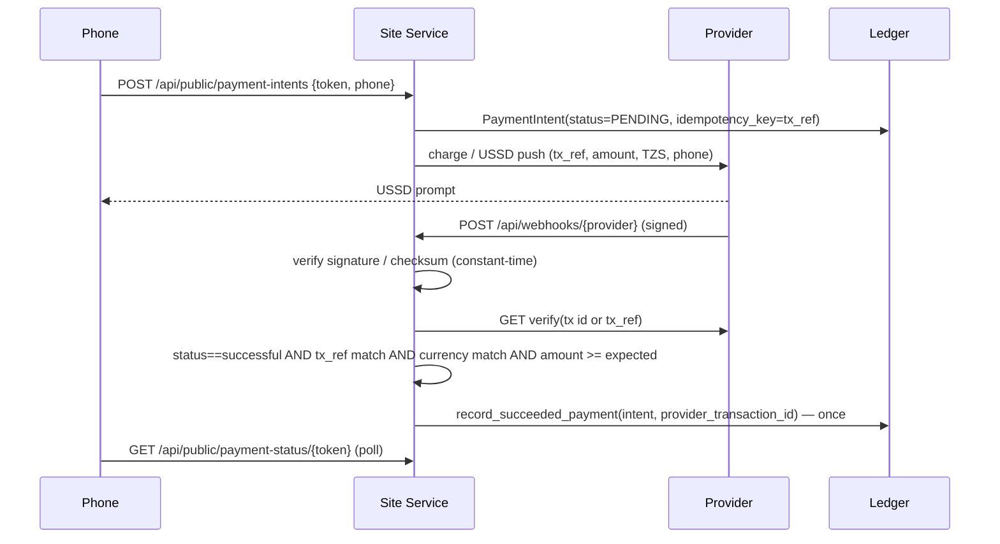

# Mobile-money providers (Flutterwave, ClickPesa) and the public payment surface

Phase 2 §8. The ledger in `app/infrastructure/payments/ledger.py` remains the
financial authority. This document covers how money from a phone reaches that
ledger without trusting a browser, a redirect, or a webhook body.

## Ownership

| Piece | File | Role |
| --- | --- | --- |
| Provider seam | `app/infrastructure/payments/__init__.py` | `PROVIDERS`, `EXTERNAL_PROVIDERS`, `is_external_provider` |
| Flutterwave v3 adapter | `app/infrastructure/payments/flutterwave.py` | TZS mobile-money charge, verify, webhook auth |
| ClickPesa adapter | `app/infrastructure/payments/clickpesa.py` | token, USSD-PUSH preview/initiate, status, checksum webhook |
| Shared helpers | `app/infrastructure/payments/common.py` | `Decimal` money, E.164 phones, redaction, HTTP+breaker |
| Orchestration | `app/services/mobile_payments.py` | intents, webhook handling, server-side settlement, reconciliation |
| Public surface guard | `app/services/public_ingress.py` | 404 for anything but the payment paths on tunnel hostnames |
| Routes | `app/api_main.py` | `/api/public/payment-intents`, `/api/public/payment-status/{token}`, `/api/webhooks/{provider}`, `/payments/health`, `/payments/reconcile` |

The HVX host, gates, cameras, MediaMTX and admin API are untouched by this slice.

## Money flow



Rules enforced in code and tests (`tests/test_payments_flutterwave.py`,
`tests/test_payments_clickpesa.py`, `tests/test_public_ingress.py`):

- A webhook with a bad or missing signature is rejected (401) and nothing is written.
- A **genuine** webhook is still only a hint: the provider is queried server-side
  and the intent is credited only when status, reference, currency and amount
  (as `Decimal`) all match. Any mismatch parks the intent in `MISMATCH` for
  staff review and writes a `payments.mismatch` audit row.
- Duplicate webhooks/reconciliation runs are idempotent: ledger key
  `mobile:{tx_ref}` plus the unique `provider_transaction_id`
  (`flutterwave:{id}` / `clickpesa:{id}`) guarantee one `SUCCEEDED` row.
- A webhook for an unknown reference is acknowledged (202) but ignored.
- A barrier is never opened from a payment handler; the exit decision reads the
  session's paid state as before.
- Provider outage → intent `FAILED` with a redacted reason, HTTP 503 on the
  public route; kiosk cash (`/p/{token}/kiosk-pay`, `/sessions/{id}/pay`) and
  local parking keep working.
- Secrets never appear in API responses, health, audit or exceptions
  (`common.redact`, `common.scrub_text`; phone numbers are masked to the last 3 digits).

### Reconciliation

`_payments_reconcile_loop` in `api_main.py` runs every
`SMARTPARK_PAYMENTS_RECONCILE_SECONDS` (default 60) **only** while `payments.core`
is enabled and the active mobile provider is external — an LPR-only site never
loads provider code. It settles `PENDING`/`CREATED` intents older than 15 s and
expires them after `SMARTPARK_PAYMENTS_INTENT_EXPIRY_MINUTES` (default 30)
without crediting. Operators can trigger the same code path with
`POST /payments/reconcile`.

### Intent states

`CREATED → PENDING → SUCCEEDED | FAILED | EXPIRED | MISMATCH`, plus `BLOCKED`
when the provider refuses to run (e.g. live not confirmed). Only `SUCCEEDED`
has a ledger transaction.

## Flutterwave (TEST by default)

Verified against the official v3 documentation:

- `POST {base}/charges?type=mobile_money_tanzania` with `tx_ref`, `amount`,
  `currency=TZS`, `email`, `phone_number` (local `07…` form), optional `network`
  (Airtel/Tigo/Halopesa/Vodafone). Response `data.status="pending"`,
  `data.id`, `data.flw_ref`.
- Verify: `GET {base}/transactions/{id}/verify` (preferred) or
  `GET {base}/transactions/verify_by_reference?tx_ref=`; `data.status` must be
  `successful`.
- Webhook authentication accepts **either** the legacy `verif-hash` header
  (equal to the configured secret hash) **or** `flutterwave-signature`
  (base64 HMAC-SHA256 of the raw body with the secret hash). Both use
  `hmac.compare_digest`. Configure the same secret hash in the Flutterwave
  dashboard and in `SMARTPARK_FLUTTERWAVE_SECRET_HASH`.
- The secret key must start with `FLWSECK_TEST-`. A live key (`FLWSECK-`) is
  refused unless `SMARTPARK_FLUTTERWAVE_ALLOW_LIVE_KEYS=1` **and** the
  `LIVE_PROVIDER_CONFIRMATION_REQUIRED` gate below is satisfied.

```env
SMARTPARK_PAYMENTS_MOBILE_PROVIDER=flutterwave
SMARTPARK_FLUTTERWAVE_SECRET_KEY=FLWSECK_TEST-...
SMARTPARK_FLUTTERWAVE_SECRET_HASH=<dashboard webhook secret hash>
# optional
SMARTPARK_FLUTTERWAVE_DEFAULT_NETWORK=Airtel
SMARTPARK_FLUTTERWAVE_CUSTOMER_EMAIL=payments@your-site.tz
```

Webhook URL to register: `https://<public-host>/api/webhooks/flutterwave`.

## ClickPesa (live-disabled by default)

Verified against docs.clickpesa.com:

- `POST {base}/generate-token` with headers `client-id`, `api-key`; the returned
  JWT already carries the `Bearer` prefix and is cached ~50 min.
- `POST {base}/payments/preview-ussd-push-request` then
  `POST {base}/payments/initiate-ussd-push-request` with `amount` (string),
  `currency="TZS"`, `orderReference`, `phoneNumber` (`2557…`, no `+`) and, when
  checksums are enabled on the application, `checksum`.
- `GET {base}/payments/{orderReference}` returns a list; `SUCCESS`/`SETTLED`
  are success, `FAILED` is failure, others pending.
- Webhooks (`PAYMENT RECEIVED`, `PAYMENT FAILED`) carry `checksum` =
  HMAC-SHA256 hex over the compact JSON of the recursively key-sorted payload
  without `checksum`/`checksumMethod`. Without
  `SMARTPARK_CLICKPESA_CHECKSUM_KEY` webhooks cannot be authenticated and are rejected.

**ClickPesa has no sandbox.** Every push moves real money, so collection is
refused (`BLOCKED`, no network call) unless all of the following are set:

```env
SMARTPARK_PAYMENTS_MOBILE_PROVIDER=clickpesa
SMARTPARK_CLICKPESA_CLIENT_ID=...
SMARTPARK_CLICKPESA_API_KEY=...
SMARTPARK_CLICKPESA_CHECKSUM_KEY=...
SMARTPARK_CLICKPESA_LIVE_ENABLED=1
SMARTPARK_PAYMENTS_LIVE_PROVIDER_CONFIRMED=1   # LIVE_PROVIDER_CONFIRMATION_REQUIRED
```

`SMARTPARK_PAYMENTS_LIVE_PROVIDER_CONFIRMATION_REQUIRED` defaults to `true` and
should stay that way; the second flag is the documented merchant sign-off.

## Public ingress (optional PublicIngressProvider)

The Site Service keeps binding to `127.0.0.1`. To let phones and provider
webhooks reach it, run a tunnel connector (for example Cloudflare Tunnel) as a
separate process and list its hostname(s):

```env
SMARTPARK_PUBLIC_INGRESS_HOSTS=pay.example.tz
```

Requests whose `Host`/`X-Forwarded-Host` is a listed hostname may only reach:

- `/p/{token}` and `/p/{token}/status` (receipt page)
- `/api/public/payment-intents`
- `/api/public/payment-status/{token}`
- `/api/webhooks/flutterwave`, `/api/webhooks/clickpesa`
- `/health`

Everything else — cameras, MediaMTX, gates, HVX host, admin API, `/docs` —
returns 404 on that hostname (`PublicIngressGuard`). Also restrict the tunnel's
own ingress rules to the same paths; the guard is defence in depth, not the
only wall. Local operators on the LAN are unaffected.

## Operator surface

- Health → "Mobile pay" chip and a plain-language sentence; `/health/details`
  → `domains.payment` (provider mode/availability/reason, counters).
- `GET /payments/health` (requires `payments.view`) → provider modes, breaker
  state, pending intent count, reconciliation timestamps, ingress policy.
- Receipt page `/p/{token}` switches to the phone-number + USSD flow
  automatically when the active provider is external; the instant simulated
  `POST /p/{token}/pay` path returns 409 in that mode.

## Rollback

`SMARTPARK_PAYMENTS_MOBILE_PROVIDER=simulated` (default) restores the
pre-Phase-2 behaviour: no provider code runs, the reconciliation loop idles,
and the receipt page uses the simulated path. Pending intents stay in the
database for audit and are not credited.

## Still hardware/merchant-dependent

- An end-to-end Flutterwave TEST transaction against the real sandbox
  (requires test keys and a reachable webhook URL).
- ClickPesa merchant testing with small live amounts before flipping
  `SMARTPARK_PAYMENTS_LIVE_PROVIDER_CONFIRMED`.
- Refunds: both adapters report `UNSUPPORTED`; refunds are operator actions in
  the provider dashboards for this release.
