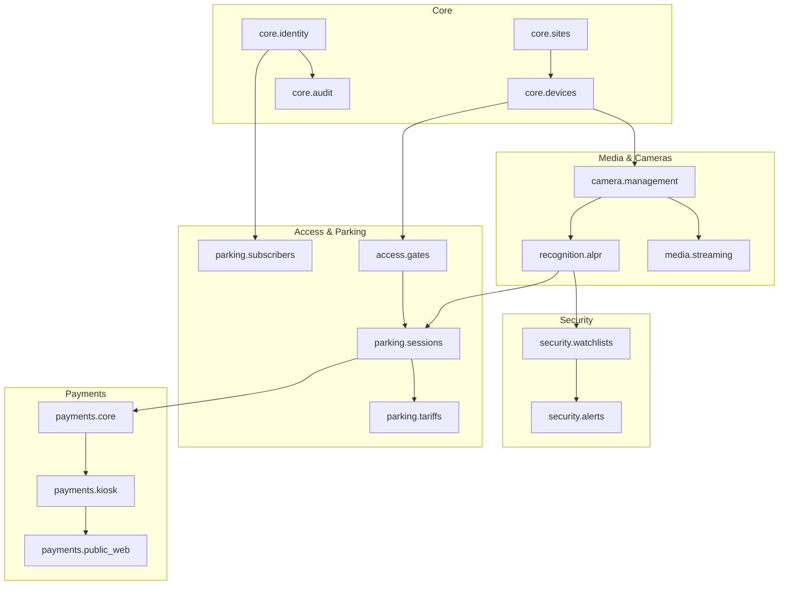

# Module Dependency Graph

```mermaid
flowchart TB
  subgraph core [Core]
    identity[core.identity]
    sites[core.sites]
    devices[core.devices]
    audit[core.audit]
  end
  subgraph media [Media & Cameras]
    streaming[media.streaming]
    cameras[camera.management]
    alpr[recognition.alpr]
  end
  subgraph security [Security]
    watch[security.watchlists]
    alerts[security.alerts]
  end
  subgraph access [Access & Parking]
    gates[access.gates]
    sessions[parking.sessions]
    tariffs[parking.tariffs]
    subs[parking.subscribers]
  end
  subgraph pay [Payments]
    pcore[payments.core]
    pkiosk[payments.kiosk]
    pweb[payments.public_web]
  end
  sites --> devices
  identity --> audit
  devices --> cameras
  cameras --> streaming
  cameras --> alpr
  alpr --> watch --> alerts
  devices --> gates
  alpr --> sessions
  gates --> sessions
  sessions --> tariffs
  sessions --> pcore
  identity --> subs
  pcore --> pkiosk --> pweb
```

Dependencies are validated in `app/services/modules.py` on enablement.
